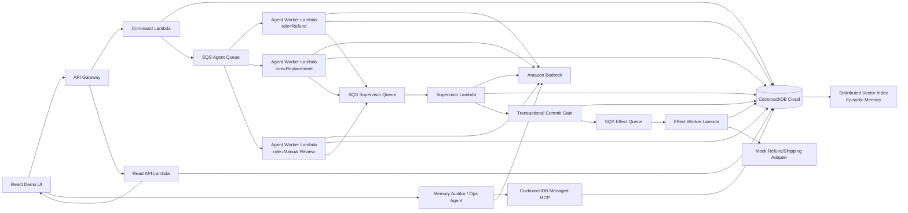

# Mutex Memory — Software Architecture

Date: 2026-08-16
Status: Approved architecture; Phase 1 implementation planning active

## 1. Architecture Goal

Build a judgeable multi-agent fulfillment exception coordinator where CockroachDB is the persistent system of record for:

1. transactional working memory — what is true now,
2. episodic memory — what agents tried and what happened,
3. semantic memory — similar historical cases retrieved by vector search,
4. audit memory — evidence showing why a decision was allowed or rejected.

The system must visibly demonstrate that agents can produce conflicting proposals while only one valid primary resolution is committed and executed.

## 2. Hardest Constraint Researched First

The hardest constraint is not LLM orchestration. It is correctness when concurrent/duplicate agent work targets the same case.

CockroachDB uses SERIALIZABLE isolation by default and may surface retryable SQLSTATE 40001 errors under contention. The official CockroachDB Node example uses node-postgres with an explicit transaction retry wrapper. Therefore:

- Bedrock calls MUST happen outside SQL transactions.
- The commit transaction MUST contain only deterministic database work.
- SQLSTATE 40001 MUST be retried with bounded exponential backoff and jitter.
- External side effects MUST NOT occur inside a retryable transaction callback.
- Unique constraints and idempotency keys MUST make duplicate event delivery harmless.

Reference implementation:
- https://github.com/cockroachlabs/example-app-node-postgres
- https://www.cockroachlabs.com/docs/stable/transaction-retry-error-reference

## 3. Chosen Architecture

### 3.1 Stack

- Language: TypeScript, strict mode, no `any`
- Monorepo: pnpm workspaces
- Frontend: React + Vite
- API: API Gateway HTTP API + AWS Lambda
- Event fan-out: Amazon SQS Standard
- Agent runtime: AWS Lambda workers
- LLM: Amazon Bedrock Converse API; model ID is configuration, with Amazon Nova Pro as the initial cloud default
- Embeddings: Amazon Titan Text Embeddings V2, 512 dimensions, normalized
- Database: CockroachDB Cloud
- SQL driver: `pg` / node-postgres, direct SQL repositories
- Validation/contracts: Zod
- Infrastructure: AWS CDK in TypeScript
- Secrets: AWS Secrets Manager
- Observability: CloudWatch + structured logs + CockroachDB audit/inspection
- Sponsor tools: CockroachDB Distributed Vector Indexing + CockroachDB Cloud Managed MCP Server

### 3.2 Why SQS + Lambda

SQS Standard + Lambda is intentionally chosen because AWS documents at-least-once processing and possible duplicate delivery. That gives the project a genuine distributed-systems failure mode to solve. CockroachDB becomes the correctness layer for duplicate and concurrent agent work.

We reject these alternatives for the MVP:

- Single orchestrator Lambda with Promise.all: simpler, but weaker production story and easier to dismiss as simulated concurrency.
- Step Functions: strong orchestration, but more infrastructure and visual complexity than the remaining hackathon scope needs.
- Bedrock Agents/AgentCore as the whole runtime: useful product surface, but it would obscure the custom memory/coordination architecture we need judges to see.

## 4. Architecture Diagram



## 5. Core Runtime Flow

### Phase A — Create case

1. UI sends a synthetic fulfillment exception.
2. Command Lambda validates it and inserts `cases` + initial `case_events` in CockroachDB.
3. It emits one SQS task per agent role using a shared `event_id` and `case_id`.

### Phase B — Concurrent agent proposals

Each agent worker:

1. loads a current case snapshot,
2. searches semantically similar completed cases,
3. calls Bedrock with role-specific instructions and typed tools,
4. returns a validated `ActionProposal`,
5. stores the proposal and evidence IDs in CockroachDB.

Agents are never allowed to mutate the committed case resolution directly.

### Phase C — Supervisor selection

Once enough proposals exist or the short proposal window expires:

1. Supervisor loads all proposals plus the current case version.
2. Bedrock chooses one proposal or `MANUAL_REVIEW`.
3. Output is parsed with Zod into `DecisionCandidate`.
4. The candidate is passed to the Commit Gate.

### Phase D — Transactional commit gate

The commit gate runs a tiny CockroachDB SERIALIZABLE transaction:

1. lock/read current case state,
2. verify `status = OPEN`,
3. verify `version = expected_version`,
4. validate domain invariants,
5. insert exactly one `case_decisions` row,
6. transition the case state,
7. insert an `action_outbox` row with a unique idempotency key,
8. commit.

If CockroachDB returns SQLSTATE `40001`, the entire database-only callback is retried. No Bedrock call and no external effect occurs inside the retry loop.

### Phase E — Effect execution

1. After commit, the dispatcher sends the outbox action to SQS immediately.
2. A periodic reconciler can re-publish any outbox row that remains pending, covering the commit-then-publish crash window.
3. Effect Worker executes a mock shipping/refund adapter.
4. `action_effects.idempotency_key` is unique, so duplicate SQS delivery is a no-op.
5. The outcome is stored as new episodic memory and embedded for later retrieval.

## 6. The Demo's Unsafe vs Safe Mode

The UI should support two explicit modes.

### Unsafe mode

Agent proposals are allowed to hit a deliberately unsafe mock effect path without a transactional commit gate. Multiple actions can appear for one case.

This code path exists only for the demo comparison and is visually marked unsafe.

### Safe mode

Agents only propose. Supervisor + CockroachDB Commit Gate chooses and commits one valid primary action. Duplicate queue deliveries are harmless.

The same fixture should be replayable in both modes so the judge sees the before/after outcome.

## 7. CockroachDB Memory Model

### 7.1 Transactional working memory

`cases`

- `id UUID PK`
- `order_id STRING`
- `event_type STRING`
- `status STRING`
- `version INT`
- `customer_tier STRING`
- `order_value DECIMAL`
- `carrier STRING`
- `created_at TIMESTAMPTZ`
- `updated_at TIMESTAMPTZ`

### 7.2 Event history

`case_events`

- `id UUID PK`
- `case_id UUID FK`
- `event_id STRING UNIQUE`
- `event_type STRING`
- `payload JSONB`
- `created_at TIMESTAMPTZ`

### 7.3 Agent proposals

`agent_proposals`

- `id UUID PK`
- `case_id UUID FK`
- `agent_role STRING`
- `action STRING`
- `confidence DECIMAL`
- `reason_codes STRING[]`
- `memory_ids UUID[]`
- `expected_case_version INT`
- `created_at TIMESTAMPTZ`

### 7.4 Episodic + semantic memory

`memory_episodes`

- `id UUID PK`
- `case_id UUID FK`
- `memory_type STRING`
- `summary STRING`
- `outcome STRING`
- `metadata JSONB`
- `embedding VECTOR(512)`
- `created_at TIMESTAMPTZ`

Use Titan Text Embeddings V2 with `dimensions=512` and `normalize=true`. Query nearest neighbors with L2 distance and create a CockroachDB vector index after seed data is loaded.

### 7.5 Committed decision

`case_decisions`

- `id UUID PK`
- `case_id UUID FK`
- `action_group STRING`
- `action STRING`
- `selected_proposal_id UUID`
- `expected_case_version INT`
- `reason_codes STRING[]`
- `memory_ids UUID[]`
- `created_at TIMESTAMPTZ`
- `UNIQUE(case_id, action_group)`

For the MVP, `action_group = 'PRIMARY_RESOLUTION'` means at most one refund/replacement/manual-review resolution can be committed.

### 7.6 Outbox + effects

`action_outbox`

- `id UUID PK`
- `decision_id UUID UNIQUE`
- `idempotency_key STRING UNIQUE`
- `effect_type STRING`
- `payload JSONB`
- `status STRING`
- `attempts INT`
- `created_at TIMESTAMPTZ`

`action_effects`

- `id UUID PK`
- `idempotency_key STRING UNIQUE`
- `effect_type STRING`
- `result JSONB`
- `executed_at TIMESTAMPTZ`

## 8. Vector Retrieval Decision

The semantic query text should be generated deterministically from the case, for example:

`lost_package | carrier=ACME | tier=gold | order_value=119 | region=US | symptoms=no_scan_after_handoff`

Retrieve top-k completed memory episodes and return only concise structured evidence to the agent.

Do not dump raw historical conversations into the prompt.

## 9. Bedrock Contract

Define one internal interface:

```ts
interface AgentModel {
  propose(input: AgentContext): Promise<ActionProposal>;
  supervise(input: SupervisorContext): Promise<DecisionCandidate>;
}
```

Implementations:

- `BedrockAgentModel` — cloud/demo implementation using Bedrock Converse.
- `MockAgentModel` — deterministic local implementation so the application builds, tests, and runs without AWS/model access.

The model only receives tools that read memory. It does not receive a raw SQL tool or a `commitDecision` tool.

## 10. Managed MCP Integration

Use the CockroachDB Cloud Managed MCP Server for a dedicated Memory Auditor / Ops Agent.

Judge-visible capabilities:

- inspect live schemas,
- select the case timeline,
- show proposals versus committed decision,
- explain the semantic retrieval query,
- inspect currently running queries during the concurrency demo.

Example UX:

`Why did case #92371 resolve to replacement rather than refund?`

The auditor uses Bedrock tool calling mapped to the Managed MCP tools and returns:

- current case state,
- proposal list,
- committed decision,
- memory episode IDs used,
- invariant that rejected any alternative.

This makes MCP a functional observability/debugging surface rather than a setup-only checkbox.

## 11. Repository Structure

```text
mutex-memory/
├─ apps/
│  └─ web/
│     ├─ src/components/
│     ├─ src/features/cases/
│     └─ src/lib/api.ts          # the only browser -> backend API wrapper
├─ services/
│  ├─ command-api/
│  ├─ read-api/
│  ├─ agent-worker/
│  ├─ supervisor-worker/
│  ├─ effect-worker/
│  ├─ outbox-reconciler/
│  └─ memory-auditor/
├─ packages/
│  ├─ agents/
│  ├─ contracts/                 # Zod schemas; frontend imports inferred types
│  ├─ db/
│  │  ├─ migrations/
│  │  ├─ repositories/
│  │  └─ with-serializable-retry.ts
│  ├─ domain/
│  ├─ memory/
│  ├─ observability/
│  └─ test-fixtures/
├─ infra/                        # AWS CDK TypeScript
├─ scripts/
│  ├─ seed-demo.ts
│  └─ run-concurrency-test.ts
├─ docs/
│  └─ architecture/
├─ CLAUDE.md
├─ ARCHITECTURE.md
└─ package.json
```

## 12. API Contracts

Browser calls only these endpoints through `apps/web/src/lib/api.ts`:

- `POST /cases` — create fixture or custom case
- `POST /cases/:id/run?mode=safe|unsafe`
- `GET /cases/:id`
- `GET /cases/:id/timeline`
- `GET /cases/:id/proposals`
- `GET /cases/:id/memories`
- `POST /audit/query`
- `POST /demo/reset`

Responses are validated by shared Zod schemas. Backend schemas drive frontend types.

## 13. Non-Negotiable Invariants

1. No LLM call inside a SQL transaction.
2. No external side effect inside a retryable transaction callback.
3. Only Commit Gate can create a committed primary decision.
4. At most one committed `PRIMARY_RESOLUTION` exists per case.
5. Every effect has a stable idempotency key.
6. Duplicate SQS messages must be safe.
7. A decision must name the memory IDs and proposal ID it relied on.
8. Store concise reason codes/evidence, not private model chain-of-thought.
9. API payloads are Zod-validated at every boundary.
10. No TypeScript `any`.
11. All browser API calls go through one typed wrapper.
12. Bedrock/MCP absence must degrade gracefully; local mock mode remains runnable.

## 14. Error Handling

### CockroachDB

- retry SQLSTATE `40001` with bounded exponential backoff + jitter,
- maximum 5 attempts for the MVP,
- record retry count in structured logs,
- abort on non-retryable SQL errors.

### Agent model

- 2 bounded retries for throttling/transient failures,
- Zod parse failure => one repair attempt,
- second parse failure => proposal becomes `MANUAL_REVIEW`,
- never let malformed model output reach the Commit Gate.

### SQS/Lambda

- batch size 1 for the critical demo workers,
- DLQ after repeated failures,
- duplicate deliveries handled by CockroachDB uniqueness/idempotency,
- correlation fields: `event_id`, `case_id`, `agent_run_id`, `decision_id`.

## 15. Observability

Every Lambda log is structured JSON containing:

- service,
- request/event ID,
- case ID,
- agent role,
- memory IDs,
- DB retry count,
- model latency,
- decision/effect outcome.

Demo dashboard metrics:

- agents started,
- proposals created,
- transaction retries,
- duplicate events seen,
- actions attempted,
- actions committed,
- duplicate actions prevented,
- semantic memories retrieved.

## 16. Security

- Database credentials and MCP credentials live in Secrets Manager.
- No secrets in the frontend or repository.
- Separate app read/write DB credential from audit/MCP access where possible.
- Lambda IAM roles get only required Bedrock/SQS/Secrets/CloudWatch permissions.
- MCP auditor is read-oriented in the demo; do not expose destructive database tools to a judge-facing prompt.

## 17. Testing Strategy

### Unit

- domain invariant tests,
- Zod contract tests,
- semantic query-builder tests,
- `40001` retry-wrapper tests,
- idempotency-key tests.

### Integration

Run CockroachDB locally and fire 25-50 parallel `commitDecision()` calls against the same case. Assert:

- exactly one primary decision exists,
- exactly one outbox idempotency key exists,
- all other callers return already-committed/stale-state rather than corrupting state.

### Agent contract

Use `MockAgentModel` for deterministic tests. Bedrock is only required in cloud smoke tests.

### End-to-end demo test

1. Reset fixture.
2. Run unsafe mode and assert >1 primary effect.
3. Reset same fixture.
4. Run safe mode and assert exactly 1 committed effect.
5. Create second similar case and assert prior memory episode is retrieved.

## 18. MVP Cut Line

### Must build

- safe/unsafe replayable demo,
- three role agents,
- CockroachDB transactional state,
- 40001 retry wrapper,
- unique decision/idempotency constraints,
- Titan embeddings + CockroachDB vector retrieval,
- Bedrock agent reasoning,
- SQS/Lambda concurrency,
- Managed MCP memory auditor,
- timeline dashboard,
- deterministic seed data,
- public deployed demo.

### Stretch only

- multi-region CockroachDB,
- real Stripe/shipping integration,
- ccloud CLI automation,
- CockroachDB Agent Skills integration,
- human approval UI,
- production auth,
- real e-commerce integration.

## 19. What Not to Build

- generic chat interface as the primary UX,
- generic RAG ingestion,
- real payment provider integration,
- Kubernetes/EKS,
- a custom agent framework,
- multiple model providers,
- elaborate user authentication,
- microservices beyond the Lambda boundaries above,
- multi-region deployment before the core concurrency demo works.

## 20. Build Order

1. CockroachDB schema + retry wrapper + concurrency integration test.
2. Safe Commit Gate with deterministic fake proposals.
3. Unsafe/safe replay demo API.
4. SQS + Lambda fan-out.
5. Bedrock proposal/supervisor adapters.
6. Titan embeddings + vector retrieval.
7. Timeline frontend.
8. Managed MCP Memory Auditor.
9. Observability, failure polish, deployment and demo recording.

No implementation prompt should be written until this architecture is accepted.
