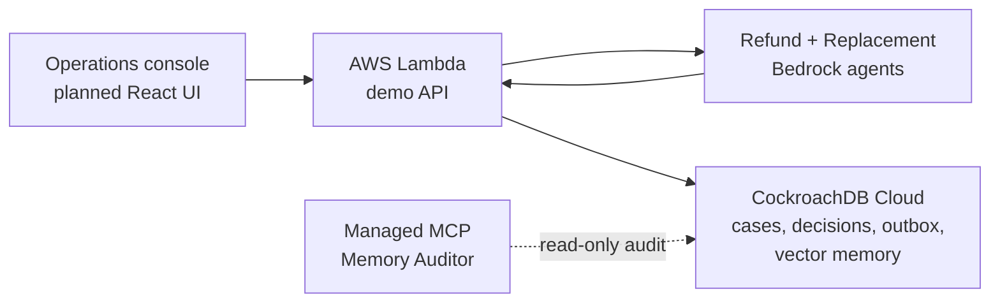

# Mutex Memory

Mutex Memory is a multi-agent fulfillment coordinator that combines CockroachDB semantic history with `SERIALIZABLE` transactional state. Agents can recall useful outcomes without issuing contradictory actions against the same live case.

Built for the **CockroachDB × AWS Hackathon — Build with Agentic Memory**.

## Why It Exists

Two agents may each make a reasonable proposal and still create an invalid system outcome. For the canonical lost-package case, one agent proposes a refund while another proposes a replacement.

| Memory layer | Question answered | Implementation |
| --- | --- | --- |
| Semantic memory | What happened in similar cases? | `VECTOR(512)` episodes and cosine retrieval |
| Transactional memory | What is true and allowed now? | CockroachDB case version, unique decision, and atomic outbox |

Unsafe mode accepts both mock effects. Safe mode races both proposals through the Commit Gate: exactly one becomes `COMMITTED`; the other becomes `ALREADY_COMMITTED`.

## Architecture



- Bedrock agents reason and propose structured actions.
- Application policy validates proposals.
- CockroachDB decides transactional admissibility; it does not perform business reasoning.
- Titan Text Embeddings V2 produces normalized 512-dimensional embeddings for cloud runs.
- The winning safe outcome is stored as a new retrievable memory episode.

## Current Status

Implemented and tested:

- Phase 1 correctness kernel and 50-way contention proof.
- CockroachDB vector schema, deterministic memory seed, and top-three retrieval.
- Mock and Bedrock proposal adapters, plus Titan embedding adapter.
- Deterministic Safe/Unsafe orchestration and winner-only episodic-memory persistence.
- Four-route Lambda API, deployable ESM bundle, and SAM infrastructure template.

Still required for the public submission: React operations console, live AWS deployment proof, judge-visible Managed MCP audit, public repository, and demo video. Cloud adapters are unit-tested but have not yet been verified against this AWS account.

## Repository Layout

```text
packages/contracts/  Zod contracts and shared types
packages/domain/     pure commit policy
packages/db/         CockroachDB migrations, retry, repositories
packages/agents/     Mock, Bedrock, and Titan adapters
packages/demo/       Safe/Unsafe orchestration and demo evidence
services/api/        JSON API and Lambda adapter
scripts/             memory seed, Lambda build, concurrency proof
infra/               AWS SAM deployment template
```

## Local Setup

Requirements: Node.js 24, pnpm 10, and a dedicated CockroachDB development database. Integration tests mutate the canonical demo fixture; never point them at production.

```powershell
corepack enable
pnpm install
Copy-Item .env.example .env.test.local
```

Replace every placeholder in `.env.test.local`, then initialize and seed the database:

```powershell
node --env-file=.env.test.local --experimental-strip-types packages/db/src/migrate.ts
pnpm seed:memory
```

Run the verification gates:

```powershell
pnpm -r typecheck
pnpm test
pnpm test:concurrency
pnpm build:lambda
```

The required contention result is 50 attempts, one committed decision, 49 harmless losers, one outbox row, and `PASS`.

## API

The Lambda Function URL exposes:

```text
POST /demo/reset
POST /demo/run
GET  /demo/cases/:caseId
POST /demo/seed-memory
```

Example run body:

```json
{ "mode": "safe", "agentMode": "mock" }
```

Use `agentMode: "bedrock"` only when AWS credentials, region, model access, and `BEDROCK_MODEL_ID` are configured. See [AWS deployment](docs/DEPLOYMENT.md) for the deployment and secret contract.

## CockroachDB Managed MCP Audit

The submission uses CockroachDB Cloud Managed MCP as a read-only Memory Auditor against the same live cluster. A judge-visible audit should inspect the canonical case, stored decision, case version, outbox intent, and cited memory IDs. MCP is an external audit path in the MVP; it is not yet exposed through the application UI.

## Security

Never commit populated environment files, database URLs, AWS credentials, certificates, or `*.secret.json` files. The public Function URL is intentionally unauthenticated for the hackathon demo and must not expose production data or real refund/shipping effects.

## License

Released under the [MIT License](LICENSE).
